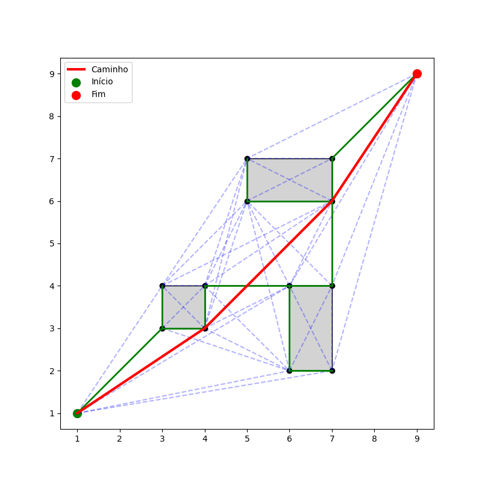

# Prática 2 — Grafos para Navegação (Robótica)

## Alunos [Luiz Eduardo Neves de Sousa](https://github.com/snowedz) e [Wictor Oliveira Soares de Lima](https://github.com/WictorSoares6)

Linguagem: Python

Bibliotecas utilizadas: OS, Numpy, Matplotlib, Math e Heapq

Descrição
---------
Este repositório contém uma solução para a "Prática 2 - Grafos para navegação". O objetivo é construir um pipeline para gerar e usar um grafo de visibilidade a partir de mapas com obstáculos, extrair uma árvore (MST) com Kruskal ou Prim, e usar essa árvore para navegação de um robô: localizar o vértice mais próximo a uma posição, buscar caminho entre vértices e plotar o resultado sobre o mapa.

Instruções
----------
Clone o reposiótio
> git clone https://github.com/snowedz/tarefa-grafos-2

Entre no diretório
> cd tarefa-grafos-2

Crie um virtual environment
> python -m virtualenv venv
> source venv/bin/activate

Instale as bilbiotecas
> pip install -r requirements.txt

Execute o código
> python main.py

Este repositório contém uma implementação em Python que:
- lê um arquivo de mapa de texto (`mapa.txt`) com definição do ponto inicial, ponto final, obstáculos poligonais e plota a imagem (`mapa.png`);
- constrói o grafo de visibilidade entre os vértices (incluir início, fim e vértices dos obstáculos);
- gera uma árvore geradora mínima (MST) usando o algoritmo de Kruskal;
- encontra o vértice mais próximo do início e do objetivo;
- calcula o caminho no grafo de visibilidade usando MST;
- plota o resultado e salva uma imagem `saida.png`.

Funções
-------------------------------------------------
- `distancia(p1, p2)` — distância euclidiana entre pontos
- `orientacao(a,b,c)`, `intersecao(p1,q1,p2,q2)` — funções auxiliares para detectar interseção de segmentos (usadas ao gerar arestas do grafo)
- Leitura de `mapa.txt` — cria `q_start`, `q_goal`, `obstaculos` (lista de polígonos)
- `arvore_vertices` — lista de vértices usados no grafo: concatena `q_start`, `q_goal` e todos os vértices dos obstáculos (nessa ordem)
- `grafo_visibilidade(vertices, obstaculos)` — retorna lista de arestas (u, v, peso) conectando pares visíveis (segmento entre vértices que não intersecta arestas de obstáculo)
- `kruskal(n, arestas)` — computa MST (lista de arestas) usando estrutura de união/busca
- `verticeMaisProximo(pos, vertices)` — retorna índice do vértice mais próximo em `vertices`
- `busca_caminho(arvore, inicio, fim)` — retorna caminho (lista de índices) entre `inicio` e `fim` usando as arestas da MST no grafo de visibilidade
- `plotar_mapa` — desenha obstáculos, ponto inicial e ponto final; salva `mapa.png`
- `plotar(...)` — desenha obstáculos, arestas do grafo, arestas da MST e o caminho final; salva `saida.png` e mostra a figura

-------------------------------------------------

# Mapa 

# Resultado 

